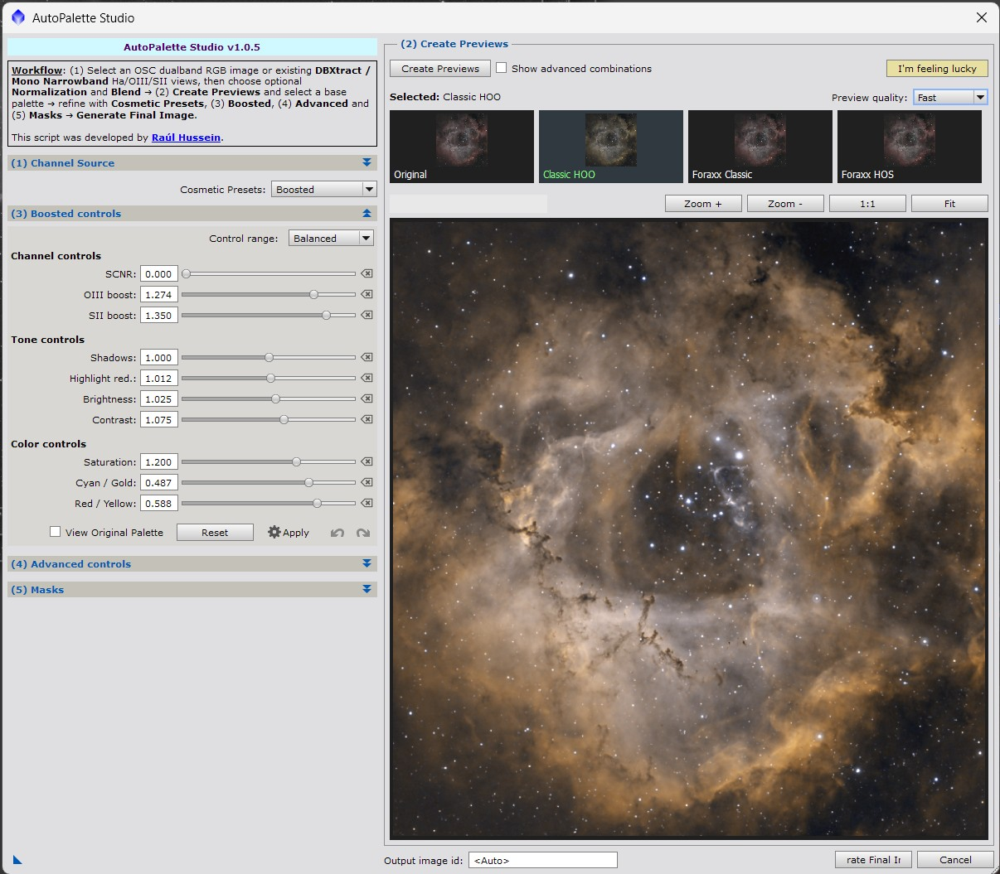

# AutoPalette Studio

  

  <strong>Interactive narrowband palette exploration for PixInsight</strong>

  
  
  

---

**AutoPalette Studio** is a PixInsight script designed to create, explore and refine narrowband color palettes from OSC dual-band images or monochrome narrowband channels.

It provides a Studio-style workflow with palette previews, boosted variants, tone and color controls, and full-resolution final image generation. The goal is simple: make narrowband palette creation faster, more visual and more enjoyable inside PixInsight.

> **Recommended workflow:** AutoPalette Studio is primarily intended for **non-linear / stretched images**, after calibration, registration, integration, background correction and initial stretching. Linear images are supported for previewing and exploration, but the most predictable creative results are obtained once the image has been stretched.

---

## Why AutoPalette Studio?

Traditional narrowband palette creation often involves many PixelMath expressions, temporary views, repeated trial-and-error adjustments and manual comparison between results.

AutoPalette Studio turns this into an interactive visual workflow where you can generate palette candidates, compare them, refine the look and create the final image from a single interface.

### Key benefits

- **Explore palettes visually** before committing to a final image.
- **Generate HOO, SHO and Foraxx-inspired looks** without writing PixelMath expressions manually.
- **Work with OSC dual-band data** or separated monochrome Ha, OIII and SII channels.
- **Use real-time controls** for brightness, contrast, saturation and color refinement.
- **Create boosted palette variants** to emphasize selected color relationships.
- **Fine-tune cyan and gold balance** with advanced controls.
- **Generate the final full-resolution image** once the preferred look has been selected.
- **Reduce intermediate clutter** by keeping the palette workflow contained in one tool.
- **Speed up creative experimentation** while keeping the process repeatable.

---

## The PIP approach

AutoPalette Studio builds on the **PIP (Power Inverted Pixels)** approach used in previous AutoPalette experiments for dynamic narrowband combinations.

PIP-based transformations are especially useful for creative narrowband palettes, including Foraxx-inspired workflows, because they do not rely only on direct RGB channel mapping. Instead, they use relationships between emission channels to enhance color separation, local contrast and perceptual richness.

In practice, this helps to:

- Reveal subtle interactions between Ha, OIII and SII.
- Produce richer Foraxx-style color transitions.
- Enhance local color contrast without excessive manual PixelMath experimentation.
- Create dynamic narrowband renderings while preserving a controlled workflow.
- Make palette exploration more intuitive, visual and iterative.

AutoPalette Studio wraps this concept into an interactive interface so the user can preview, compare and refine the result before generating the final image.

---

## Supported input data

AutoPalette Studio can work with:

- **OSC dual-band images**
- **Monochrome Ha + OIII images**
- **Monochrome Ha + OIII + SII images**
- Narrowband channels extracted with tools such as DBXtract
- Linear or non-linear sources, although **non-linear images are recommended** for final creative use

---

## Recommended image preparation

For best results, prepare your data before running AutoPalette Studio:

1. Calibrate your light frames.
2. Register and integrate your images.
3. Apply background extraction / gradient correction.
4. Perform channel preparation and neutralization if needed.
5. Stretch the image or channels to a non-linear state.
6. Open the source image or channels in PixInsight.
7. Run AutoPalette Studio.

The script can generate previews from linear data, but the creative palette controls are designed to be most useful after the image has been stretched.

---

## Basic workflow

1. **Select Image**  
   Choose the source OSC image or the available narrowband channels.

2. **Palette Configuration**  
   Select the palette workflow and available channel configuration.

3. **Create Previews**  
   Generate visual palette candidates.

4. **Boosted**  
   Explore stronger palette variations.

5. **Advanced**  
   Refine tone, saturation, cyan/gold balance and color emphasis.

6. **Generate**  
   Create the final full-resolution image.

---

## Installation

### Manual installation

1. Download `AutoPalette_Studio.js` from the latest release or from the `src` folder.
2. Copy it to your PixInsight scripts folder.
3. Open PixInsight.
4. Go to `SCRIPT > Feature Scripts...`.
5. Click `Add` and select the folder containing the script.
6. Run AutoPalette Studio from the PixInsight script menu.

### PixInsight update repository

A PixInsight update repository may be provided in a future release.

For detailed instructions, see [Installation guide](docs/installation.md).

---

## Documentation

- [Installation guide](docs/installation.md)
- [Usage guide](docs/usage.md)
- [Changelog](changelog.md)

---

## Requirements

- PixInsight 1.8.9 or later
- PixInsight JavaScript Runtime / PJSR
- OSC dual-band data or separated Ha, OIII and optional SII channels

---

## Notes and limitations

AutoPalette Studio is a creative palette exploration tool. It does not replace calibration, integration, background extraction, deconvolution, noise reduction or the general image processing workflow.

The quality of the result depends strongly on the quality of the input data, channel balance, stretch, signal-to-noise ratio and the amount of real Ha, OIII and SII signal available.

---

## License

AutoPalette Studio is distributed under the terms of the **GNU General Public License v3.0**.

See [LICENSE](LICENSE) for details.

---

## Author

This script was developed by **Raúl Hussein**.

- Astrocitas YouTube Channel: https://www.youtube.com/@astrocitas
- Instagram: https://www.instagram.com/rahusga/

---

## Acknowledgements

AutoPalette Studio evolved from previous AutoPalette experiments and was inspired by dynamic narrowband palette workflows used by the astrophotography community, including Foraxx-style creative combinations.

---

## Disclaimer

This script is provided as-is, without warranty. Always test new versions with copies of your data before using them in production workflows.
